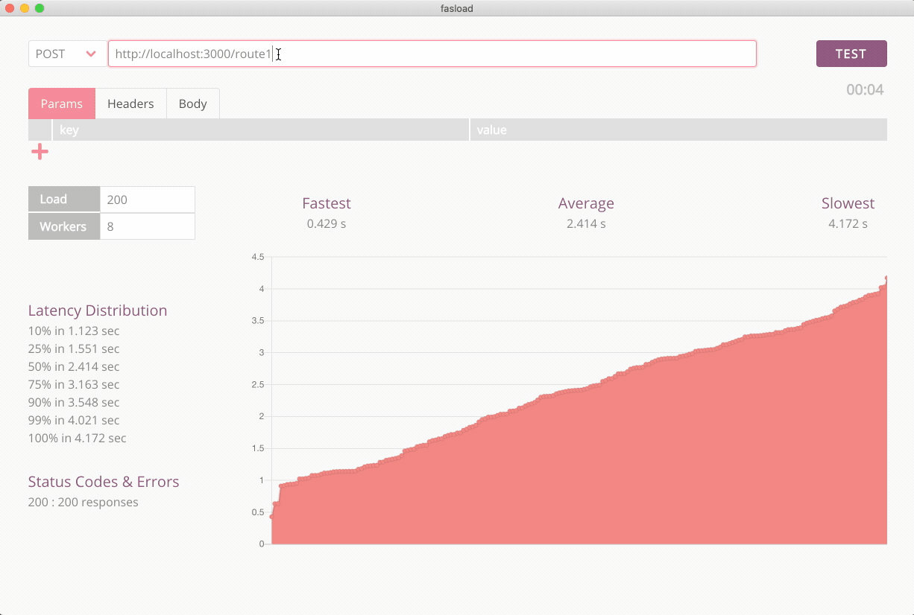

# fasload

> A simple, cross platform, benchmarking tool for testing RESTful services under load.



## Project setup
```
npm install
```

### Compiles and hot-reloads for development
```
npm run electron:serve
```

### Compiles and minifies for production
```
npm run electron:build
```

### Runs unit tests
```
npm run test:unit
```

### Lints and fixes files
```
npm run lint
```
